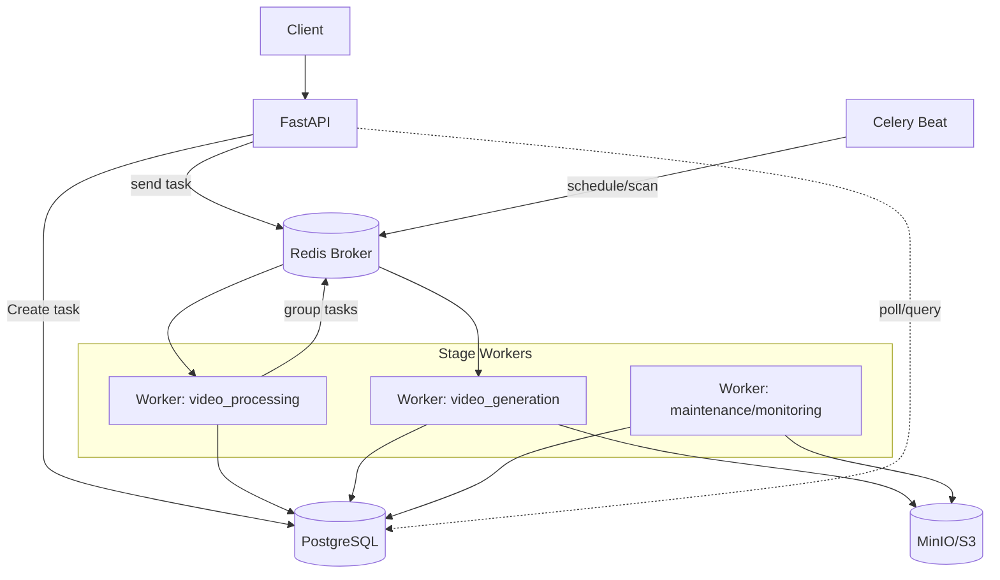

## 项目架构（目标形态）

- **架构目标**
  - 可水平扩展、可观测、易于回放/补偿的任务编排体系
  - 计算与协调解耦，阶段化治理重试/超时/限流
  - 数据与产物持久化，避免依赖进程内状态或 result backend 存大结果

### 系统组件
- **API 层（FastAPI，异步）**
  - 接收请求、参数校验、鉴权、写入任务元数据/状态；异步 ORM（SQLAlchemy Async/asyncpg）
  - 创建任务后立刻返回 `task_id`，不做重计算

- **任务编排（Celery + Redis Broker + Celery Beat）**
  - 通过 `chain/group/chord` 组织流程与多视频并发
  - Beat 负责周期性维护/轮询外部合成状态（如无 webhook）

- **阶段工作器（Stage Workers，按队列分池）**
  - `video_processing`：素材处理/分析/脚本生成的协调或拆分
  - `video_generation`：视频合成子任务（可 group 并发）
  - `maintenance`：清理、补偿、健康检查
  - `monitoring`：巡检、指标采集
  - Worker 使用同步驱动（psycopg2、同步 HTTP 客户端），与 API 的 asyncio 栈隔离

- **存储层**
  - PostgreSQL：任务状态机/审计/子任务结果索引、去重幂等键
  - MinIO/S3：大文件与视频产物；DB 仅存引用与元信息
  - Redis：仅作 Celery broker/result（大结果禁用）

- **可观测与运维**
  - Flower（生产需鉴权/内网）、结构化日志（含 task_id/sub_task_id/stage）、Prometheus/Grafana 指标

### 数据与控制流（简图）

### 任务编排（最佳实践）
- 全流程拆分为原子任务：
  - 1) 素材处理 → 2) 素材分析 → 3) 脚本生成 → 4) 视频生成
  - 多视频使用 `group(单视频任务...) + chord(聚合回调)` 汇总
- 幂等性：
  - 以 `task_id`/外部 `courseMediaId` 建立唯一约束或条件更新，确保重复投递安全
- 结果存储：
  - 大结果与产物入 OSS，DB 存引用/元数据；Celery 设置 `task_ignore_result=True`（或分类）
- 外部视频合成：
  - 两段式：提交即返回（入库外部 `courseMediaId`）→ Beat 轮询/或 webhook 回调更新状态

### 可靠性与限流
- `acks_late` + 幂等，崩溃可安全重投
- `autoretry` + 指数退避 + `time_limit/soft_time_limit`
- 分队列/分池并发控制，外部接口速率限制、熔断与舱壁隔离
- 死信队列（DLQ）：重试用尽任务转入 DLQ 并提供人工/自动补偿

### 安全与配置
- 密钥/凭据统一走环境变量与密钥管控（Vault/Secrets Manager）；仓库不留明文
- CORS 限定可信域；Flower/监控入口需鉴权与网络隔离
- 配置中心或环境分层（dev/staging/prod）统一管理端点与阈值

## 迭代计划 Todo List（按优先级）

### P0（立刻修复/高风险）
- [X] 移除明文密钥与默认值，`config.py` 仅从环境读取；新增 `.env.example` 与部署文档
- [x] 关闭 Flower 未认证访问；加反向代理鉴权与 IP 白名单（已默认仅本机访问，支持可选基础认证；生产代理示例见 `DEPLOYMENT.md`）
- [x] CORS 从 `*` 收敛为可信域清单
- [x] 修正 `celery_config.py` 的 `task_routes` 为实际任务名 `tasks.video_processing_tasks.*`
- [x] 引入幂等保护：阶段与子任务的唯一键/条件更新，避免重复提交外部合成与重复写入

### P1（高优先）
- [ ] 拆分 `process_text_to_video` 为阶段化任务：素材处理→素材分析→脚本生成→视频生成
- [ ] 多视频生成改为 `group + chord` 聚合，父任务只负责协调与落库
- [ ] 视频合成改为“两段式”：提交即返回；实现 Beat 轮询进行中任务的状态（兼容 webhook）
- [x] Beat 轮询实现：`tasks.video_merge_polling.poll_video_merge_results`（含超时处理，阈值取 `settings.multi_video_generation_timeout`）
- [ ] 统一并发与池模型：使用 prefork；为各队列设置并发/内存上限（应用 `worker_max_tasks_per_child`）
- [ ] 限流/熔断：为外部合成/LLM/下载加速率限制、重试退避与舱壁隔离
- [ ] 结果后端轻量化：大任务 `task_ignore_result=True`，仅 DB/OSS 持久化结果
- [ ] 结构化日志与指标：日志含 `task_id/sub_task_id/stage`，暴露阶段耗时/失败率/队列滞留指标

### P2（中优先）
- [ ] 数据库索引与模式优化：
  - [ ] 幂等/去重唯一索引
  - [ ] 多视频结果拆表或规范化存储，避免单行膨胀
  - [ ] 长事务切分与慢查询观测
- [ ] 文件与工作目录治理：生成即上传 OSS，本地临时目录定期清理；完善 `cleanup_expired_tasks`
- [ ] 部署硬化：端点改服务名/配置中心；容器最小权限与只读根文件系统；网络策略收敛
- [ ] 集成测试补齐：编排链路（chain/group/chord）、幂等/重试/超时回归；高并发下外部限流场景

### P3（低优先/体验）
- [ ] API 体验：任务创建返回更明确的追踪与轮询/回调指引；提供阶段重试/重放接口
- [ ] 分布式追踪（OpenTelemetry）：API→编排→子任务链路打通
- [ ] 文档与运维：扩/缩容、限流开关、DLQ 处理流程、安全基线（密钥轮换）、SLO/容量规划

### 里程碑与交付（建议）
- 里程碑 M1（1 周）：完成 P0 + P1 中编排拆分与两段式落地，跑通端到端链路；产出基准压测与指标看板
- 里程碑 M2（2–3 周）：完成 P1 其余项 + P2 核心项（DB/清理/部署硬化/测试矩阵）
- 里程碑 M3（持续）：P3 体验与可观测增强，完善文档与运维 SOP

—
本文件作为架构蓝图与迭代跟踪清单，建议在 PR 中持续维护，并在每次版本发布前完成对照勾选与复盘。

### 问题记录
- [x] 异步代码清理删除
- [x] 素材处理，media_items表中视频的分辨率resolution缺失
- [ ] 公众号视频自动拉取打标
- [x] 视频生成加速，素材分析脚本生成支持并行处理
- [x] 素材分析优化，增加主题、时长等描述，减少关联上下文，优化提示词，让描述更加符合主题，精简字数
- [ ] 视频没有全部落库并传递到素材分析
- [ ] 视频生成有问题
- [ ] 脚本生成关联素材时，素材描述没有完整关联
- [ ] 脚本生成优化，素材很多，脚本中的素材却很少，要尽量将素材全部包含进去
- [ ] 视频生成优化，结合素材实际分辨率、时长，动态配置素材的位置。可能需要一个单独的剪辑智能体来处理？
- [ ] 支持自定义水印

### 需求记录
- [ ] 支持动态字幕
- [ ] 支持转场
- [ ] 脚本生成增加seo专家环节，设置单独提示词，专门用来生成标题、视频描述、标签

