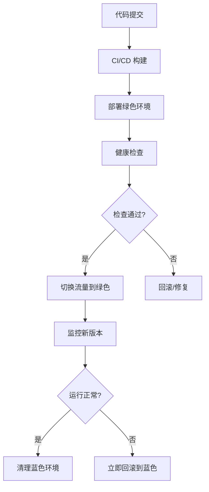

# TextLoom 生产环境架构设计

## 🏗️ 系统架构概览

### 高可用多层架构
```
┌─────────────────────────────────────────────────────────────────┐
│                          用户访问层                                │
├─────────────────────────────────────────────────────────────────┤
│  CDN (CloudFlare)  │  DNS (Route53)  │  WAF (Web Application)   │
└─────────────────────────────────────────────────────────────────┘
                                  │
┌─────────────────────────────────────────────────────────────────┐
│                          负载均衡层                                │
├─────────────────────────────────────────────────────────────────┤
│        ALB/NLB (AWS)  │  Nginx Ingress  │  Service Mesh        │
└─────────────────────────────────────────────────────────────────┘
                                  │
┌─────────────────────────────────────────────────────────────────┐
│                      Kubernetes 集群                             │
├─────────────────────────────────────────────────────────────────┤
│  ┌─────────────┐  ┌─────────────┐  ┌─────────────┐            │
│  │   前端Web   │  │   API网关   │  │   管理后台   │            │
│  │ (Next.js)   │  │  (Istio)   │  │  (Admin)   │            │
│  └─────────────┘  └─────────────┘  └─────────────┘            │
│                                                               │
│  ┌─────────────┐  ┌─────────────┐  ┌─────────────┐            │
│  │  API服务    │  │  认证服务    │  │  支付服务    │            │
│  │ (FastAPI)   │  │  (Auth)    │  │ (Payment)  │            │
│  └─────────────┘  └─────────────┘  └─────────────┘            │
│                                                               │
│  ┌─────────────┐  ┌─────────────┐  ┌─────────────┐            │
│  │  任务处理器   │  │  优先队列    │  │  定时调度器   │            │
│  │ (Workers)   │  │(Priority-W) │  │(Scheduler) │            │
│  └─────────────┘  └─────────────┘  └─────────────┘            │
└─────────────────────────────────────────────────────────────────┘
                                  │
┌─────────────────────────────────────────────────────────────────┐
│                          数据层                                  │
├─────────────────────────────────────────────────────────────────┤
│  ┌─────────────┐  ┌─────────────┐  ┌─────────────┐            │
│  │PostgreSQL   │  │    Redis    │  │    MinIO    │            │
│  │(主数据库)    │  │ (缓存/队列)  │  │  (对象存储)  │            │
│  │Master+Slave │  │   Cluster   │  │  Distributed│            │
│  └─────────────┘  └─────────────┘  └─────────────┘            │
└─────────────────────────────────────────────────────────────────┘
                                  │
┌─────────────────────────────────────────────────────────────────┐
│                      监控和运维                                   │
├─────────────────────────────────────────────────────────────────┤
│  ┌─────────────┐  ┌─────────────┐  ┌─────────────┐            │
│  │ Prometheus  │  │   Grafana   │  │AlertManager│            │
│  │(指标收集)    │  │  (可视化)    │  │  (告警)    │            │
│  └─────────────┘  └─────────────┘  └─────────────┘            │
│                                                               │
│  ┌─────────────┐  ┌─────────────┐  ┌─────────────┐            │
│  │     ELK     │  │   Jaeger    │  │   Sentry    │            │
│  │  (日志)     │  │ (链路追踪)   │  │ (错误监控)   │            │
│  └─────────────┘  └─────────────┘  └─────────────┘            │
└─────────────────────────────────────────────────────────────────┘
```

## 🏢 基础设施架构

### AWS EKS 集群配置
```yaml
集群规格:
  - 版本: Kubernetes 1.28+
  - 节点组配置:
    - 管理节点: 3 × t3.medium (控制平面)
    - 计算节点: 5 × c5.2xlarge (API服务)  
    - 工作节点: 10 × c5.4xlarge (AI处理)
    - 高性能节点: 3 × c5.9xlarge (优先任务)
  - 网络: VPC with 3 AZ, Private/Public Subnets
  - 存储: EBS GP3 + EFS for shared storage
```

### 服务网格 (Istio)
```yaml
功能特性:
  - 流量管理: 蓝绿部署, 金丝雀发布
  - 安全策略: mTLS, RBAC, JWT验证
  - 可观测性: 分布式追踪, 指标收集
  - 故障恢复: 熔断器, 重试, 超时控制
```

## 🔄 部署策略设计

### 1. 蓝绿部署流程


### 2. 金丝雀部署配置
```yaml
# Istio VirtualService for Canary
apiVersion: networking.istio.io/v1alpha3
kind: VirtualService
metadata:
  name: textloom-canary
spec:
  hosts:
  - api.textloom.ai
  http:
  - match:
    - headers:
        canary:
          exact: "true"
    route:
    - destination:
        host: textloom-api
        subset: canary
  - route:
    - destination:
        host: textloom-api
        subset: stable
      weight: 95
    - destination:
        host: textloom-api
        subset: canary
      weight: 5
```

## 📊 性能和扩展性设计

### 自动扩缩容策略
```yaml
HPA配置:
  API服务:
    - 最小副本: 5
    - 最大副本: 50  
    - CPU阈值: 70%
    - 内存阈值: 80%
    - 自定义指标: RPS > 1000
  
  Worker服务:
    - 最小副本: 10
    - 最大副本: 100
    - CPU阈值: 75%
    - 队列长度: > 50 tasks
    - 响应时间: > 5 minutes

VPA配置:
  - 自动调整资源请求
  - 基于历史使用情况
  - 避免资源浪费
```

### 数据库高可用设计
```yaml
PostgreSQL配置:
  架构: 主从复制 + 读写分离
  主库: RDS PostgreSQL 14 (db.r5.2xlarge)
  从库: 2 × RDS 只读副本 (db.r5.xlarge)
  备份: 
    - 自动备份: 7天保留
    - 快照备份: 每日凌晨2点
    - 跨区域备份: 每周异地备份
  
连接池:
  - PgBouncer: 连接池中间件
  - 最大连接数: 200 (主库), 100 (从库)
  - 连接复用: Transaction级别
```

### 缓存架构设计
```yaml
Redis集群:
  架构: 主从 + 哨兵模式
  节点配置: 3主 + 3从 + 3哨兵
  内存配置: 每节点 16GB
  持久化: AOF + RDB
  
缓存策略:
  - L1缓存: 应用内存 (5分钟TTL)
  - L2缓存: Redis (30分钟TTL)  
  - L3缓存: CDN (24小时TTL)
  
热点数据:
  - 用户会话: Redis (2小时TTL)
  - API结果: Redis (15分钟TTL)
  - 静态资源: CDN (1天TTL)
```

## 🛡️ 安全架构设计

### 网络安全
```yaml
网络隔离:
  - VPC私有网络
  - 安全组规则
  - NACLs访问控制
  - WAF Web应用防火墙

流量加密:
  - TLS 1.3终端加密
  - mTLS服务间通信
  - 证书自动轮换
  - HSTS强制HTTPS
```

### 身份认证和授权
```yaml
认证系统:
  - JWT Token认证
  - OAuth2.0授权
  - Multi-Factor Authentication
  - SSO单点登录支持

权限控制:
  - RBAC基于角色
  - 租户数据隔离
  - API访问控制
  - 审计日志记录
```

### 数据安全
```yaml
数据保护:
  - 静态数据加密 (AES-256)
  - 传输数据加密 (TLS 1.3)
  - 敏感数据脱敏
  - 数据备份加密

密钥管理:
  - AWS KMS密钥管理
  - 密钥自动轮换
  - 硬件安全模块 (HSM)
  - 密钥访问审计
```

## 📈 监控和可观测性

### 监控体系架构
```yaml
指标收集:
  - Prometheus: 系统和应用指标
  - Node Exporter: 主机指标
  - cAdvisor: 容器指标
  - Custom Metrics: 业务指标

可视化:
  - Grafana: 指标可视化
  - Kibana: 日志分析
  - Jaeger UI: 链路追踪
  - 自定义Dashboard: 业务监控

告警系统:
  - AlertManager: 告警路由
  - Slack: 即时通知
  - PagerDuty: 紧急呼叫
  - Email: 邮件通知
```

### 日志管理架构
```yaml
日志收集:
  - Filebeat: 日志采集
  - Logstash: 日志处理
  - Elasticsearch: 日志存储
  - Kibana: 日志分析

日志分类:
  - 应用日志: INFO/WARN/ERROR
  - 访问日志: Nginx/API Gateway
  - 审计日志: 用户操作记录
  - 安全日志: 登录/权限变更

数据保留:
  - 热数据: 7天 (高性能存储)
  - 温数据: 30天 (标准存储)
  - 冷数据: 90天 (归档存储)
```

### 性能监控指标
```yaml
系统指标:
  - CPU使用率: < 70%
  - 内存使用率: < 80%
  - 磁盘使用率: < 85%
  - 网络延迟: < 100ms

应用指标:
  - API响应时间: P95 < 500ms
  - 错误率: < 1%
  - 并发用户数: 实时监控
  - 任务处理能力: > 1000/hour

业务指标:
  - 用户注册转化率: > 5%
  - 视频生成成功率: > 95%
  - 用户留存率: > 80%
  - 收入增长率: > 20%/month
```

## 🚨 故障恢复和灾难处理

### 故障等级定义
```yaml
P0 - 严重故障:
  - 服务完全不可用
  - 数据丢失风险
  - 响应时间: 15分钟内
  - 解决时间: 2小时内

P1 - 高级故障:
  - 核心功能异常
  - 性能严重下降
  - 响应时间: 30分钟内
  - 解决时间: 4小时内

P2 - 中级故障:
  - 部分功能异常
  - 用户体验受影响
  - 响应时间: 2小时内
  - 解决时间: 8小时内
```

### 备份和恢复策略
```yaml
数据备份:
  - 实时备份: 数据库写入同步
  - 增量备份: 每小时增量
  - 全量备份: 每日全量
  - 异地备份: 每周跨区域

恢复测试:
  - 每月恢复演练
  - RTO目标: < 1小时
  - RPO目标: < 15分钟
  - 自动化恢复脚本
```

### 应急响应流程
```yaml
故障响应:
  1. 自动检测: 监控系统告警
  2. 人工确认: 工程师验证
  3. 影响评估: 确定故障等级
  4. 应急处理: 执行恢复计划
  5. 根因分析: 问题深度调查
  6. 改进措施: 防止重复发生

通信机制:
  - 内部通知: Slack/企业微信
  - 用户通知: 状态页面更新
  - 客户沟通: 邮件/电话通知
  - 媒体发布: 重大故障公告
```

## 🔧 运维自动化

### CI/CD流水线
```yaml
代码构建:
  - 代码检查: ESLint, Pylint
  - 安全扫描: SAST, DAST
  - 单元测试: 覆盖率 > 80%
  - 集成测试: API/数据库测试

部署流程:
  - 镜像构建: Docker多阶段
  - 安全扫描: 容器漏洞检测
  - 部署验证: 健康检查
  - 回滚机制: 自动回滚条件

环境管理:
  - 开发环境: 自动部署
  - 测试环境: 手动触发
  - 预发环境: 审批部署
  - 生产环境: 多级审批
```

### 基础设施即代码
```yaml
工具链:
  - Terraform: 基础设施管理
  - Helm: Kubernetes应用管理
  - ArgoCD: GitOps部署
  - Ansible: 配置管理

版本控制:
  - Git: 代码版本管理
  - 分支策略: GitFlow
  - 标签管理: 语义化版本
  - 变更记录: 自动生成
```

## 💰 成本优化策略

### 资源成本优化
```yaml
计算资源:
  - Spot实例: 开发/测试环境
  - Reserved实例: 稳定工作负载
  - 自动扩缩容: 按需分配资源
  - 闲时缩容: 非业务时段降低配置

存储优化:
  - 生命周期管理: 数据自动归档
  - 压缩存储: 日志/备份压缩
  - 重复数据删除: 减少存储空间
  - 冷数据迁移: 低频访问数据

网络优化:
  - CDN缓存: 减少源站流量
  - 数据压缩: gzip/brotli压缩
  - 区域部署: 降低跨区域传输
```

### 运营成本控制
```yaml
人员成本:
  - 自动化运维: 减少人工操作
  - 故障预防: 降低故障处理成本
  - 培训投资: 提高团队效率
  - 工具优化: 提升开发效率

第三方服务:
  - 服务对比: 定期评估供应商
  - 合同谈判: 争取更好价格
  - 用量监控: 避免意外费用
  - 替代方案: 开源替代评估
```

通过这个全面的生产环境架构设计，TextLoom将具备企业级的高可用性、安全性和可扩展性，能够支撑大规模SaaS服务的稳定运行。